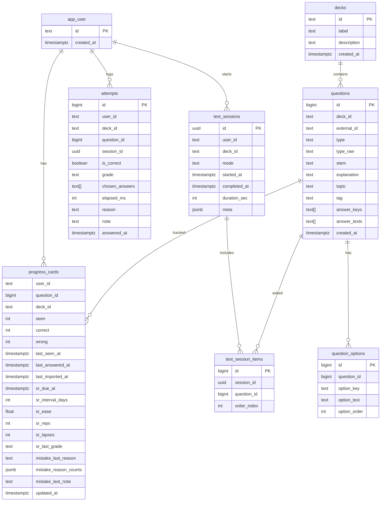

# アーキテクチャ設計（DB移行/SSOT化）

## 目的
- 学習履歴（progress）を localStorage から Postgres に移行し、DB を唯一の正（SSOT）とする。
- 問題データを JSON 同梱から DB 格納へ移行し、10k+ の問題数でも高速に動作できるようにする。
- 既存の学習体験（練習/模試/SR/統計/誤答理由/インポート・エクスポート）を維持する。
- PWA の「インストール」「オフラインで起動（アプリシェル）」は維持し、オフライン時は **閲覧のみ** または **キューして送信** のいずれかをサポートする。

## 目標アーキテクチャ概要
```
PWA (index.html/app.js)
  ├─ Service Worker: アプリシェルのキャッシュ
  ├─ API Client
  │   ├─ /api/decks
  │   ├─ /api/questions (paging/filter)
  │   ├─ /api/review (今日の復習/弱点/タグ/未学習)
  │   ├─ /api/attempts
  │   ├─ /api/test-sessions
  │   └─ /api/progress/summary
  └─ Offline:
      ├─ shell cached (必須)
      └─ progress write → 送信キュー or read-only

Vercel Functions (/api)
  ├─ Auth: Bearer token / user id
  ├─ Domain/Service層 (SR更新, セッション生成)
  └─ Repository層 (SQL, paging)

Postgres
  ├─ decks
  ├─ questions / question_options
  ├─ progress_cards
  ├─ attempts
  ├─ test_sessions / test_session_items
  └─ schema_migrations
```

## ERD（Mermaid）


## DBスキーマ & インデックス方針（抜粋）
- `questions(deck_id, tag, topic)` に複合インデックス。
- `progress_cards(user_id, deck_id, sr_due_at)` で Due 取得を最速化。
- `progress_cards(user_id, deck_id, seen)` で未学習優先取得を最速化。
- `attempts(user_id, answered_at desc)` で統計/履歴集計を高速化。
- `test_session_items(session_id, order_index)` で復元を高速化。

## API仕様（案）
### 認可
- `Authorization: Bearer <token>` を必須。
- `user` をクエリまたはヘッダで受け、サーバ側で `user_id` として正規化。
- 認可失敗は `401`。

### エンドポイント
- `GET /api/decks`
  - レスポンス: `{ decks: [{id, label, description, questionCount}] }`
- `GET /api/questions?deckId=...&tag=...&topic=...&cursor=...&limit=...`
  - ページング（keyset/pagination）。
  - レスポンス: `{ items: [...], nextCursor }`
- `GET /api/review/today?deckId=...&limit=20`
  - SR Due → 新規の順。
- `GET /api/review/weak?deckId=...&limit=10`
  - 誤答数 + Due を優先。
- `GET /api/review/untouched?deckId=...&limit=10`
  - `progress_cards.seen = 0` を優先。
- `GET /api/review/tag?deckId=...&tag=...&limit=10`
- `POST /api/attempts`
  - 入力: `{questionId, grade, chosenAnswers, elapsedMs, reason, note, sessionId?}`
  - SR 更新はサーバ側で実施し、更新後の `progress` を返却。
- `POST /api/test-sessions`
  - 模試 100問生成（ORDER BY random() なし、IDレンジ抽出 + サンプリング）。
- `GET /api/test-sessions/:id`
  - セッション復元。
- `POST /api/import/progress`
  - 旧 progress JSON を DB へ取り込み。

### エラー
- `400`: 入力不正
- `401`: 認可失敗
- `404`: 存在しないリソース
- `409`: 競合
- `500`: 想定外エラー

## 移行計画
1. **Phase 0**: DB接続 & マイグレーション基盤、/api/health のDB疎通。
2. **Phase 1**: 問題データの DB格納 + JSON取り込み CLI。
3. **Phase 2**: progress の DB化 API（レビュー取得/回答/統計/模試）。
4. **Phase 3**: フロントを API 駆動に変更し、localStorage progress を撤去。
5. **Phase 4**: 旧 progress JSON の取り込みツール + 回帰テスト/軽量E2E。

## パフォーマンス設計
- `ORDER BY random()` を避け、IDレンジサンプリングや事前に作成した候補セットを利用。
- Due 取得は `progress_cards.user_id + deck_id + sr_due_at` のインデックスで 20 件取得。
- 未学習優先は `seen = 0` を優先し、足りない分だけランダムサンプル。

## オフライン運用方針
- **アプリシェルはキャッシュ**、オフラインでも起動可能。
- progress は **DB優先**。
- オフライン時は以下のいずれかを採用:
  - **閲覧のみ**（progress 更新 UI を無効化）
  - **キュー送信**（IndexedDB などに回答イベントを保存しオンライン復帰時に送信）

## セキュリティ
- すべての SQL はパラメタ化。
- Bearer token を必須とし、未認可の書き込みを拒否。
- メモ/誤答理由は表示時に必ず無害化。

## 移行インターフェース
- フロント UI から progress JSON をアップロード可能にする。
- CLI 取り込みも提供（`node scripts/import-progress.js` など）。
